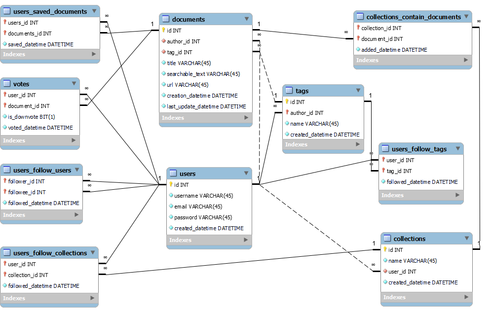

# Backlog Zero

## Table of Contents
- [Backlog Zero](#backlog-zero)
  - [Table of Contents](#table-of-contents)
  - [Description](#description)
  - [Features](#features)
  - [Technologies Used](#technologies-used)
  - [Installation](#installation)
    - [Prerequisites](#prerequisites)
    - [Steps](#steps)
  - [Usage](#usage)
    - [Running the Application](#running-the-application)
    - [Basic Usage](#basic-usage)
  - [Configuration](#configuration)
    - [Environment Variables](#environment-variables)
  - [Database Schema](#database-schema)
    - [Tables](#tables)
    - [Relationships](#relationships)
  - [API Endpoints](#api-endpoints)
    - [User API](#user-api)
    - [Document API](#document-api)
    - [Tag API](#tag-api)
  - [Contribution Guidelines](#contribution-guidelines)
  - [Contact Information](#contact-information)
  - [Motivation](#motivation)

## Description
Backlog Zero is a web application developed by students for students. It is designed to streamline the organization and accessibility of study materials, leveraging an upvoting system to filter content effectively. The platform aims to provide a structured approach to document organization and search.

## Features
- Upvoting system for content filtration
- Structured document organization and search
- User and document management
- Collection and tagging of documents

## Technologies Used
- **Frontend**: React, Next.js
- **Backend**: Kotlin, Spring Boot
- **Database**: SQL-based relational database (schema included in `DDL.sql`)
- **Styling**: CSS (see `globals.css` and `page.css`)
- **Icons**: FontAwesome
- **APIs**: RESTful APIs (endpoints listed below)

## Installation
### Prerequisites
- Node.js and npm
- Java and Kotlin setup
- Database setup (e.g., MySQL, PostgreSQL)

### Steps
1. **Clone the repository**:
    ```sh
    git clone https://github.com/BacklogZero-MC2/backlog-zero.git
    cd backlog-zero
    ```

2. **Install frontend dependencies**:
    ```sh
    cd frontend
    npm install
    ```

3. **Install backend dependencies and set up the database**:
    - Run the scripts provided in `DDL.sql` and `test_data.sql` to set up your database schema and seed data.

4. **Start the frontend**:
    ```sh
    npm run dev
    ```

5. **Start the backend**:
    - Instructions for starting the Kotlin/Spring Boot server (include specific commands or IDE setup).

## Usage
### Running the Application
- Start the frontend using the above npm command.
- Start the backend using the provided instructions.
- Access the application via `http://localhost:3000`.

### Basic Usage
- Log in using provided credentials or register as a new user.
- Use the search and filter options to find documents.
- Upvote documents to help filter quality content.
  
## Configuration
### Environment Variables
- Set up necessary environment variables (e.g., database connection strings, API keys) in a `.env` file.

## Database Schema


### Tables
- **users**: Stores user information.
- **documents**: Stores document metadata.
- **tags**: Stores tags for categorizing documents.
- **votes**: Stores upvote/downvote information.
- **collections**: Stores user-created collections of documents.

### Relationships
- Users can follow other users, tags, and collections.
- Documents can belong to multiple collections and tags.

## API Endpoints
### User API
- **GET /api/users**: Fetch all users.
- **GET /api/users/:id**: Fetch a specific user.
- **POST /api/users**: Create a new user.
- **PUT /api/users/:id**: Update user information.
- **DELETE /api/users/:id**: Delete a user.

### Document API
- **GET /api/documents**: Fetch all documents.
- **GET /api/documents/:id**: Fetch a specific document.
- **POST /api/documents**: Create a new document.
- **PUT /api/documents/:id**: Update document information.
- **DELETE /api/documents/:id**: Delete a document.

### Tag API
- **GET /api/tags**: Fetch all tags.
- **GET /api/tags/:id**: Fetch a specific tag.
- **POST /api/tags**: Create a new tag.
- **PUT /api/tags/:id**: Update tag information.
- **DELETE /api/tags/:id**: Delete a tag.

## Contribution Guidelines
We currently do not accept direct contributions. Please follow the guidelines below if you wish to contribute indirectly:
- **Reporting Issues**: Use the issue tracker to report bugs or request features.
- **Pull Requests**: Fork the repository and submit pull requests for review. Ensure your code follows our coding standards and includes relevant tests.
- **Code of Conduct**: Follow our code of conduct in all interactions related to this project.

## Contact Information
- **Maintainers**: Adrian Gojević, Nikolina Kucelin
- **Support**: For support, please contact us via [agojevic@tvz.hr] or [nikolina.kucelin@gmail.com]

## Motivation
- This project was developed as part of an academic competition.
