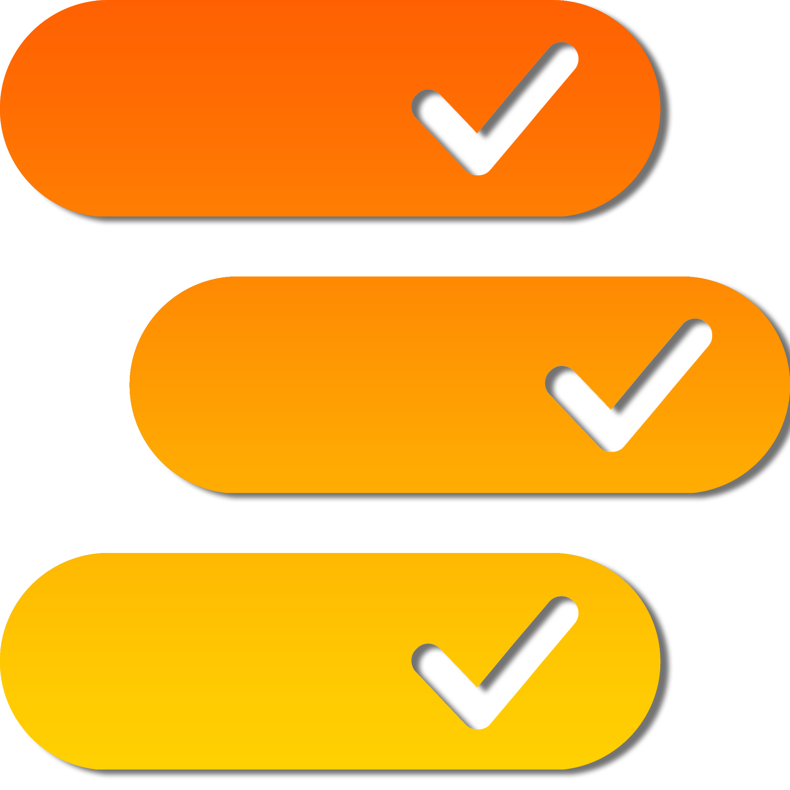

# Backlog Zero
Učenje na dlanu. Brzo dijeli, lako uči, beskrajno istražuj.

## O projektu
Backlog Zero je projekt koji nastoji riješiti problem kaotičnosti i neorganiziranosti u studentskim grupama, gdje kvalitetni materijali često padaju u zaborav. Naša platforma pruža strukturu u organizaciji i pretraživanju materijala te koristi naprednu tehnologiju kao što su OCR obrada i AI preporuke kako bi korisnicima olakšala pristup i korištenje relevantnih informacija.

## Značajke
- Pregledni repozitorij materijala za sve predmete

- Upvoting sustav za kvalitetan sadržaj

- AI mentor koji analizira aktivnost korisnika i pruža personalizirane preporuke

- Mogućnost dijeljenja materijala i suradnje s drugim korisnicima

## Kako sudjelovati
Ako želite doprinijeti projektu, slobodno pogledajte naše otvorene probleme (issues) ili nas kontaktirajte kako bismo razgovarali o mogućnostima suradnje. Također, pozivamo vas da pratite našu priču i sudjelujete u razvoju zajedno s nama.

## Kontakt
Za sva pitanja ili prijedloge slobodno nas kontaktirajte putem emaila: backlogzero.mc2@gmail.com

Hvala vam što ste dio Backlog Zero zajednice!
